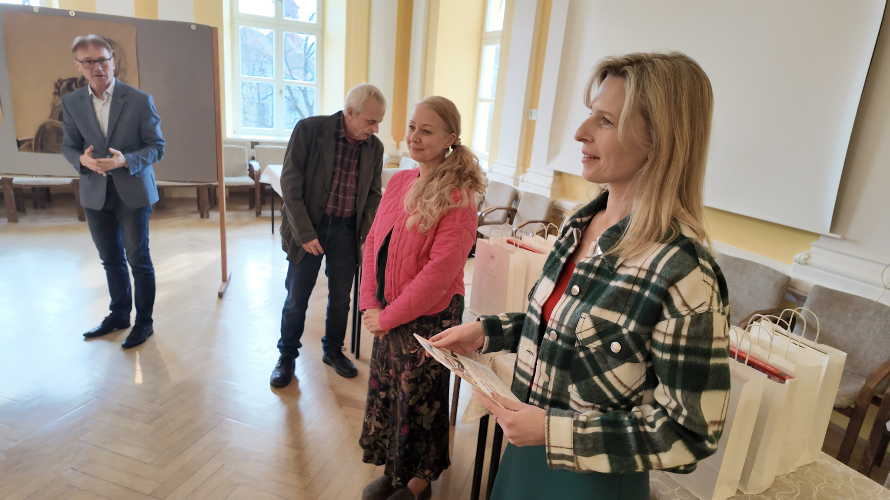

Společná cesta nabídla prostor pro pozorování detailu, diskuzi o architektuře a propojení výuky s místem, které je samo o sobě živou kulturní učebnicí.

## Architektura jako učebnice

V Litomyšli jsme sledovali, jak se historické prostředí potkává se současnou architekturou. Každá zastávka nabízela jiné měřítko, materiál i způsob práce se světlem.

Další inspiraci jsme hledali v [programu města Litomyšl](https://www.litomysl.cz/) a v materiálech [Národního památkového ústavu](https://www.npu.cz/).

## Krátká videozastávka

<iframe src="https://www.youtube-nocookie.com/embed/aqz-KE-bpKQ" title="Ukázkové video k práci s obrazem a prostorem" loading="lazy" allow="accelerometer; autoplay; clipboard-write; encrypted-media; gyroscope; picture-in-picture; web-share" allowfullscreen></iframe>

## Zvukový záznam cesty

Přehrávač níže slouží jako ukázka zvukové stopy vložené přímo do článku.

<audio controls preload="none" aria-label="Ukázkový zvukový záznam">
  <source src="https://www.soundhelix.com/examples/mp3/SoundHelix-Song-1.mp3" type="audio/mpeg" />
  Váš prohlížeč nepodporuje přehrávání zvuku.
</audio>

## Program dne

| Čas | Místo | Zaměření |
| --- | --- | --- |
| 8:00 | Opava | Odjezd od školy |
| 10:15 | Litomyšl | Prohlídka historického centra |
| 13:00 | Zámecké návrší | Skicování a fotografická dokumentace |
| 16:30 | Opava | Návrat a sdílení poznámek |
